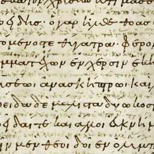

Reading this thesis is more than just becoming more familiar with the *Iliad*, its history of scholarship, and those newer developments in its scholarship in the digital era. More generally, the process of reading this thesis constitutes an engagement with a text. Like all texts, this thesis has two primary components: the textual content and its formatting or presentation. While the content should reign king in an undergraduate research thesis, the formatting is just as important for relaying the information contained within these pages.

Admittedly, the presentation of my information is not particularly noteworthy. Thus it may appear that claiming my presentation to be as important as my content is a bit far-fetched. On the contrary, my presentation is not noteworthy precisely because I chose to present my content in the exact same way as countless others have before me. That is, I am writing text in a single column that will extend onto many pages and this text is split up into many paragraphs. Overall, most readers probably would never spend more than a few seconds pondering the formatting of this material since it follows the manner of publication that has been the standard for centuries. However, if I chose to write this thesis in two columns without any paragraph breaks, I should not expect many people to read much beyond the first few lines. The wall of text would be too jarring.

In either case it should be clear that formatting matters when it comes to fashioning an effective text. I raise the reader's attention to the now-standard method of formatting this thesis precisely because the two texts which lie at the heart of this thesis apply methods of publication which were standard in their own day, but are vastly different from today's standard. On the one hand is the epic poem the *Iliad*. In its modern incarnation, the *Iliad* runs about fifteen thousand lines as a printed text. The *Iliad*, however, was not originally a printed text; rather, it arose out of an oral tradition which originated over three thousand years ago.

On the other hand there is the tenth-century C.E. Venetus A manuscript which contains one such written version of the *Iliad*. This manuscript contains the oldest surviving complete text of the *Iliad*. As if its age were not impressive enough, each page of the manuscript is replete with a wealth of scholarly notes, called scholia (singular: scholion), which provide commentary on the poem. These scholia are divided among five different margins of the manuscript such that they surround the text on each manuscript page. This is a far cry from the modern system of footnoting which relegates similar scholarly notes to the bottom margin of the page, giving the impression that the footnotes are less important than the regular text. On the contrary the scholia of the Venetus A are so all-encompassing that it is hard to view them in the same dismissive light as modern footnotes.

It is precisely the format of these scholia, divided among the various margins of the manuscript page, which will become the focus of this thesis. The overall goal of my research was to use digital technologies to investigate what sort of relationship existed, if any, between a scholion's position within a particular margin and its content. Beyond a curiosity in the creation of this manuscript, this line of inquiry does have broader implications for the field of Homeric studies. More is needed to be said in this preface about the nature of the Venetus A and its scholia before these implications can be fully understood. For now, however, it is sufficient to say that if I can show that particular margins of the manuscript are strongly correlated with particular discussions of Iliadic scholarship, then one might be able to state more definitively what works served as the sources for each particular margin. From there, one could extrapolate with more certainty exactly what information about Iliadic scholarship came from what time periods and what authors.

Why precisely this inquiry into the sources of the scholia is of any importance is ultimately the purpose of this first chapter. Chapter two will detail the methods I used to prepare the Venetus A scholia for analysis, while chapter three will detail more in-depth the actual analysis and initial findings using these technologies. Finally, the concluding chapter will focus my attempt to explore the relationship between two seemingly similar zones of the scholia. In that final chapter I will also contextualize the most significant results from the third chapter and fourth chapters and explain how my findings shed light on the creation of the Venetus A.

Before going any further, it is necessary to ground my work in that of previous scholars and to clarify my assumptions towards the figure known as Homer. Prior assumptions held that an ancient Greek known as Homer *wrote* the two seminal epics of the Western literature, the *Iliad* and the *Odyssey*. However, the scholarly opinion is much more divided today. On the one hand is the opinion put forth by the eminent classical scholar Martin West in his 1998 critical edition of the *Iliad*. For West, the *Iliad*, "was the work of a single poet of the greatest ability" (*unius munus fuit maximi poetae*, v), and it was written (*Ilias... conscripta est*, v).
This opinion is by no means the dominant opinion. As far back as the first century C.E. the Jewish historian Josephus makes the claim that the poems were not written down originally but were composed as songs. Over a long span of time these songs were remembered and eventually written down (qtd. in Wolf 94). This oral theory took on a whole new life in the late eighteenth century with the writings of Friedrich Wolf. In his 1795 preface to *Iliad*, Wolf not only expands on the theory put forth by Josephus and others, but goes one step further. Wolf suggests boldly that:

>...this entire connected series of the two continuous poems is owed less to genius of him to whom we have normally attributed it, than to the zeal of a more polite age and the collective efforts of many, and that therefore the very songs from which the *Iliad* and *Odyssey* were assembled do not all have one common author... (Wolf, 70)

This is a view which Wolf himself says "one must accept" (70) and which I believe holds greater weight than that of West. Not only does Wolf acknowledge the importance of song for the creation and spread of the two poems, but he does away with the idea of a single poet, something which Josephus still seemed to believe existed. For Wolf and for his followers, there is no Homer and there is no single poet. To be fair to West, he acknowledges the key role of song and bards in proliferating the epic poems (*Ilias materiam continet iamdiu per ora cantorum diffusam*, v), but he diverges most importantly from the view of Wolf and other oral theorists in his assertion that even these songs "first got the form and cohesion as we know them at that time when it was written" by that single poet (v).
The idea that the *Iliad* and *Odyssey* were originally composed as songs for performance is one that has persisted far beyond Wolf. More and more scholars are confidently presenting new evidence which forces the figure of "Homer" to yield his genius to a tradition of oral poets. One of the most notable contributions in this respect comes from the collaboration of Milman Parry and Albert Lord in the early twentieth century. The pair studied the living oral poetic tradition of Yugoslavia with the hopes that their knowledge might illuminate their understanding of the Homeric epics as an oral poem (Lord, 3). The two asserted that this oral poetry of the Slavic people was not simply poetry being read aloud, but rather poetry which was being composed in its performance (Lord, 5). Furthermore, it was based on their comparative study of the nature of the Slavic traditional oral poems and their understanding of the formulaic nature of the Homeric poems that the pair concluded that the Homeric poems are oral poems (Lord, 141).

While the epics were composed and proliferated in an oral tradition, it is plainly obvious from the fact that they survive as written poems that they were written down at some point. Gregory Nagy laid out his model for the evolution of the Homeric tradition from an oral composition to the fixed text we have today in his book *Homeric Questions*. In it, Nagy notes that the *Iliad* was probably first beginning to be transcribed sometime during the sixth-century B.C.E., which would be at least a few centuries after the poem was first being composed in performance as an oral poem (Nagy, 42). If this is true, then one must wonder why the two poems have been considered the work of a single man. Nagy accounts for the Greeks' attribution of the works to the creative figure known as "Homer" by noting that this would not be the first time the Greeks attributed a large societal achievement to a single "cultural hero," (Nagy, 21). Just as legendary Greek lawmakers are often lauded “as the originators of the sum total of customary law as it evolved through time. So also with Homer: he is retrojected as the original genius of epic" (Nagy, 21).

While this transition from oral epic to written text was more of a process than a singular event, it is clear from antiquity that the Homeric poems were well-known, well-respected, and well-read. The poems were considered so important that in the third and second centuries B.C.E., three separate heads of the Library at Alexandria took it upon themselves to edit written texts of Homer. What was different by the time of the Alexandrian editors was that the idea that the epics arose from oral epics had fallen out of view and the figure of Homer as a singular creative force was fairly concrete. Thus the purpose of the three Alexandrian recensions was to revise the text in order to restore it to how it was originally written by Homer. Again, it was Wolf's insights into the nature of the two poems that cast a shadow upon the virtue of such a process. If Homer truly does not exist and the epic poems were composed-in-performance repeatedly by oral poets across Greece for centuries, "what, then, will it mean to restore these poems to their original luster and genuine beauty?" (Wolf, 70). To expand on Wolf's question, how can one represent in a print medium a poem which, by nature of its strictly oral origins, was recomposed with every performance, such that there is no one definitive version of the *Iliad* or *Odyssey*?

An effective solution to this editing problem would only come two centuries after Wolf with the creation of the Homer Multitext project. Put briefly, the Homer Multitext abandons the medium of print altogether. In an article detailing the editorial standards of their project, the two main editors of the Homer Multitext, Casey Dué and Mary Ebbott, argue that the fuller representation of the Homeric epics' oral tradition is only possible in a digital medium. As suggested by Wolf, the goal of editing the Homeric epics is not to create a poem as its "author" knew it. Rather the editors of the Homer Multitext are interested in preserving all extant versions of the Homeric poems. So whereas variants in the manuscript tradition of Cicero, Vergil, the Gospels, or any work which was composed in writing, are treated as an opportunity to tease out which of the variants is the "correct reading," variants in the Homeric epic do not necessarily imply that one or other variant is incorrect. Rather, it is entirely valid that different manuscripts record variant readings and that these variants arose from the different, though completely valid, performances by different bards across time. The precise mechanics of oral poetry lay beyond the scope of this thesis, but it is worth noting again that many of the variants in the *Iliad* would not be occurring because singers willingly tried to make a new version of the poem. That is, an oral poet who was sang the *Iliad* repeatedly would not be trying to sing the song differently each time. In fact, Parry and Lord found that the Yugoslavian singers would often claim that they would sing entire songs with the exact the same words and lines as another singer, even if this was not true (Lord, 28). This is because these oral poets are not simply reciting a memorized text, but are recomposing the story while in performance. Thus Dué and Ebbott stress that the “singers themselves do not strive to innovate, but they nevertheless compose a new song each time" (7). As such, the Homer Multitext strives not to create a version of the Homeric texts which presents project’s favorite selection of variants from all the different manuscripts, but rather wishes to present all the variant readings of the epics together and without preference. To that end, the project refers to the variants as "multiforms," a term originated by Albert Lord because the term "multiform" refrains from giving any preference to a particular reading and "it acknowledges that [an] idea may exist in several forms" (qtd. in Dué and Ebbott, 7).

As for the actual architecture of the digital editions created by the Homer Multitext project, more will be explained in the second chapter on methodology when it is more relevant. For now it is more important to discuss the general philosophy behind their editions. Again, the Homer Multitext is not looking to present a traditional critical edition like Martin West's 1998 edition. Traditional critical editions aim to provide a single version of a text. The Homer Multitext on the other hand uses digital technologies precisely because a digital format "can more readily handle multiple texts" (Dué and Ebbott, 2). In order to have multiple texts at hand, multiple texts need to be digitized. It is in this process of digitally transcribing the text of individual manuscripts that we at the Homer Multitext spends most of its time. The project commits itself to creating diplomatic editions of individual manuscripts. Where, as mentioned, a traditional critical edition aims to provide the "correct" reading of a manuscript, our diplomatic edition aims to recreate the text of the manuscript exactly as it appears. It is only by exactly transcribing a series of manuscripts including their scholia that the multiformity of the epic poems can be fully preserved.

What makes any of this work possible is the release of digital photography of various manuscripts under a Creative Commons License. Centuries-old manuscripts are extremely fragile documents that require particular environmental condition in order to be preserved. As such, manuscripts are difficult to access, especially for Americans as most manuscripts are held in libraries in Europe. So without some sort of photography, it would be next to impossible today to access any manuscript long enough to fully transcribe it. Thus, the rising trend in digitally photographing entire manuscripts has allowed for increased access to manuscript for all scholars.

Even though the photography allows the manuscripts to be perennially available, it is unavoidable that, even with as large a team as the Homer Multitext project has, transcribing an entire manuscript of the *Iliad* takes a good deal of time. The Venetus A, for example, contains over six hundred pages, many of which are filled to the brim with scholia. As such, project members come to spend so much time with these manuscripts that the number of new conclusions reached concerning the creation behind these manuscripts is unsurprising. However, the amount of scholarship produced by project members cannot just be explained by the virtue of how much time they spend with the manuscripts. It must also be attributed to the complexity of the manuscripts themselves as well as the problems of interpretation they pose.

Nowhere is this level of interpretational complexity more apparent than the aforementioned case of the scholia’s formatting in the Venetus A. To repeat information from before, the Venetus A is an extremely important document for the field of Homeric studies for a number of reasons. For one, it contains the entire text of the *Iliad* and, since it dates back to the tenth century C.E., it is the oldest existing manuscript to do so. Still, it is the scholia which have caught the attention of scholars for centuries. For a variety of reasons the Venetus A was essentially forgotten around the time of the Renaissance (Blackwell and Dué, 6). However, once it was rediscovered by Jean Baptiste Gaspard d’Ansse de Villoison in the late 1700s, news of the manuscript and scholia spread quickly among Homeric scholars. Wolf reports that Villoison’s edition of the manuscript was famous precisely because scholars were forced to wait to read it themselves and grew excited (Wolf, 50).

There is much more about these scholia that warrant excitement than just the anticipation of reading them, particularly since the manuscript is now readily available online. For one thing, at the end of nearly every book in the Venetus A, there is a subscription which cites what sources were used when creating the scholia the scholia. Karl Dindorf discusses the importance of this subscription, among many other things, in the preface to his 1875 edition of the Venetus A scholia. As Dindorf lays out fairly clearly, this subscription is the starting point for every argument about the age and origin of the scholia, even going back as far as Wolf (*Omnes autem hae disputationes... subscriptione... proficiscuntur*, xix). The following is the subscription as it appears at the end of Book 2:

>παράκειται τὰ Ἀριστονίκου σημεῖα καὶ τὰ Διδύμου περι τῆς Ἀρισταρχείου διορθώσεως· τινὰ δὲ καὶ ἐκ τῆς Ἰλιακῆς προσωδίας Ἡρωδιανου καὶ ἐκ τοῦ Νικάνορος περὶ στιγμης⁑

>Lying beside [the text of the *Iliad*] are the following works. *The Signs* by Aristonicus, *On the Aristarchean Recension* by Didymus. And there is something from *Iliadic Prosody* by Herodian and *On Punctuation* by Nicanor.

What precisely is "lying beside" the text must be a reference to the scholia. The subscription gives the impression that the scholia consist of these various works in their entirety, but this simply cannot be true. As described earlier, the scholia works as a system of footnotes and thus it would be illogical if entire works of other scholarship were appearing in footnotes. Far more likely, the subscription is trying to get across that the scholia consist of excerpts from those four sources put forth. However, as Dindorf makes clear in his preface, the subscription is not exactly true anymore. For one thing, Dindorf notes that the ancient commentator Porphyry is mentioned rather infrequently in the Venetus A compared to his appearance in other manuscripts (xiii), but the mere fact that Porphyry is mentioned at all throws the veracity of the subscription under suspicion. Porphyry flourished in the third century C.E., while the latest of the authors mentioned in the subscription, Nicanor and Herodian, lived in the second century C.E. Secondly, Dindorf is certain that in the tenth century C.E., when the Venetus A was being created, the four works described would most certainly have been lost (*qui libri quum pridem perditi essent quo tempore codex Venetus scriptus est*, xi).

Despite these temporal inconsistencies, Dindorf largely maintains that the subscription is an accurate reflection of what is in the Venetus A scholia. The mere fact that the subscription has been preserved gives witness to the fact that the Venetus A falls at the end of a long tradition of copying manuscripts that began with some initial collection that included this particular subscription (xi). Over time, however, that original collection of scholia would begin to be copied. Karl Lehrs describes this process well, saying that a scribe might not drastically alter the text of the scholia, but might add something he had recently read from a new commentary, especially if something arises which contradicts one of those four original sources (qtd. in Dindorf xii). Thus, by this line of reasoning, one can safely assume that some of the scholia in the Venetus A, though certainly not all, do indeed have some basis in the four sources mentioned in the subscription.

With that matter settled, the importance of the Venetus A becomes increasingly clear. Whether or not one can discern if a particular scholion comes from Didymus or some other scholar, the corpus of scholia in the tenth-century Venetus as a whole provide a glimpse into the history of Homeric scholarship that, at its most conservative estimates, ranges back to the scholarly writings of Didymus in the first century B.C.E. Diving deeper, however, from the titles of their books, it is known that Didymus and Aristonicus worked closely with the work of Aristarchus, the latest and most prominent of the three Alexandrian editors, all of whom revised and edited the *Iliad* in the third and second centuries B.C.E. As Dindorf states plainly, "we nearly owe to [Didymus and Aristonicus] alone that which he have about the editions of Aristophanes, Zenodotus, and Aristarchus, [the three Alexandrian editors]" (xv). Dindorf goes on to explain that Didymus and Aristonicus did not just consult the work of the Alexandrians, but their work would have excerpted straight from the commentary of Aristarchus (xvi). Aristarchus's commentary and other Aristarchean commentary would have in turn dealt directly with the work of Aristarchus's predecessors at the library at Alexandria, Zenodotus and Aristophanes.

Thus, it is not too far of a stretch to claim that the scholarship contained within the Venetus A gives a glimpse into the scholarship of the Alexandrian editors. Since the *Iliad* was originally composed within an oral tradition, these older works of scholarship allow scholars today to look ever so slightly into the range of multiforms that abounded in the ancient world before the text was edited into a more rigid written form, most likely due to the work of the Alexandrian editors. If, for example, Aristarchus disagrees with a reading provided by his predecessor, Zenodotus or Aristophanes, often Aristarchus will record what Zenodotus or Aristophanes wrote before putting forth his own reading. Thus, through Aristarchus's own argumentation, evidence for the multiformity of the *Iliad* is ever increased. Perhaps what is a more interesting prospect, and a more subtle one as well, is the opportunity to tease out specific patterns of language which are unique to the various sources. Since the scholia are essentially dealing with layers of scholarship, being able to adeptly identify patterns of language could help accomplish what Dindorf considers a necessary task for researching the scholia: separating out the scholia of the four scholars mentioned in the subscription (xv). While this process of singling out the authors of specific scholia is not at all the focus of this thesis, the idea that the specific zones of the scholia might contain distinct language patterns that reflect different sources is of the utmost importance to this work.

Still, it is worth noting that the Venetus A is so noteworthy particularly because it provides such key insights into the Alexandrian editors, and it does so abundantly. It is for this reason precisely that Wolf gives thanks to the Venetus A as it provides so much material for understanding Aristarchus' body of work (Wolf, 190). Dindorf also praises the utility of the Venetus A, saying that no other manuscripts has been found which can rival the Venetus A in its abundance of scholia excerpted from the four sources mentioned in the subscription (xxix). However, there is one more significant feature of the Venetus A that Dindorf highlights as setting the manuscript apart from others: the appearance of Aristarchan critical signs (*Codices Veneto A omni ex parte similes, id est signis criticis Aristarchi... instructi, nulli usquam reperti sunt*, xxix). Graeme Bird, in a more recent article on critical signs, tempers Dindorf's excitement only a little, explaining that critical signs do appear in other manuscripts and papyri, but never as fully as they are used in the Venetus A (95). Aristonicus's treatise *On the Signs of Aristarchus* exists only in fragments so a full explanation of the signs purpose from an ancient source is impossible, but much has been gathered through the observation. First of all, the critical signs in the Venetus A work as another sort of marker to indicate that there will most likely be a scholion on a line. The critical signs always appear in the space directly to the left of the beginning of a line of *Iliad* text.

Very often scholia on lines which have critical signs will begin with some sort of phrase that refers back to the critical signs such as
"ἡ διπλῆ παράκειται ὅτι..." ("the 'diple' [one of the critical signs] lies next to the line because..."). Often those introductory words can end up being abbreviated to just "ὅτι" ("because") (Dindorf, xix). The critical signs are so important because they offer a clear insight into the scholarship of Aristarchus, as each of the various critical signs (diple, asterisk, dotted diple, etc.) convey a different meaning about the scholion the sign appears next to. Much can be done to explore the relationship between a specific critical sign and the contents of any corresponding scholia. This sort of research might help elucidate how the various margins of the manuscript function.

The above discussion of exploring critical signs and content is the first real hint of the type of questions this thesis is interested in exploring, though that particular inquiry is not explored in this thesis. Before diving into the inquiries which were explored, I must engage in one of the hallmarks of the Homer Multitext project: its focus on visual evidence. This chapter began by asserting that the format of a text can be just as important as its content, thus it seems appropriate to spend some time addressing the manuscript's form.

Pictured above is the first page, or folio, of the Venetus A manuscript which contains text of the *Iliad*. Admittedly, this folio, folio 12 recto, is a misrepresentation of the average manuscript page as few folios come close to rivaling 12r in terms of scholia density. Still, due to this exaggerated density, it is a very useful folio for demonstrating the general layout of the manuscript.

In the middle of every manuscript page, seen above on the darker text, are the verses of the *Iliad*. Almost every folio contains exactly twenty-five lines of the poem. Every other mark or letter that is not part of those twenty-five darker lines of the poem picture constitute this folio's scholia.

Even for someone who did not know any Greek, it is clear from the above picture the scholia do not form a singular document. Rather the scholia are divided into five distinct zones. As Mary Ebbott notes in a 2011 talk on the Venetus A and multiformity, "It's impossible to just read it from top to bottom, left to right" (Muellner and Ebbott, 6:05). The above picture illustrates more easily the five distinct sets of scholia, as each color represents a different set. As one can see from the distribution, the different sets of scholia are not distributed evenly among the manuscript, but rather each set occupies a unique zone of the manuscript page. The naming conventions for each set of scholia are rather straightforward as a set’s name intuitively reflects its position on the page. Thus those blue scholia located in between the *Iliad* text and the inner binding of the codex are referred to as the interior scholia. Similarly the green scholia located on the outer edge furthest from the binding of codex are the exterior scholia. The largest set of scholia, located in the primary margin and highlighted in yellow are simply referred to as the main scholia. The scholia highlighted in red, located in the margin between the *Iliad* text and the main scholia are the intermarginal scholia. Finally, the scholia which are not highlighted but which are located in between the actual lines of the *Iliad* are simply referred to as the interlinear scholia. 

There are many questions which rise naturally from viewing this unique five-zoned layout. Is the division between the sets of scholia always this rigid? How do the scholia interact with the *Iliad* lines on a single page of the manuscript? Are there any meaningful differences in content between the various sets of scholia? If so, is there any indication that each set of scholia derives from its own source?  These and other questions are the very inquiries which sit at the core of this thesis. While most of the answers to the questions can only be answered by analyzing the text of the scholia, some questions concerning the manuscript's formatting have been addressed simply by nature of observation.

For example, prior research has been conducted into the vertical distribution of scholia, particularly main scholia, on the manuscript page. The question of vertical distribution deals with the ways in which a scribe works to align the text of Iliad with any scholia commenting on that line, i.e. is there any system which puts scholia in close proximity to the lines they comment on. Maria Maniaci, for example, described how scribes of various *Iliad* manuscripts, not including the Venetus A, were able to maintain line-to-scholion proximity. The examples from her research seem to deal exclusively with pages which are extremely dense. She hoped that that the stress the scribe must have felt when trying to fit so much information on a single page would result in a document that revealed the underlying structure (Maniaci, 268). Her ideas were expanded upon by members of the Homer Multitext project in order to understand more readily how the Venetus A was composed. Rather than focus on just dense folios of the manuscript, the Homer Multitext researchers intended to use their entire extant dataset to cover photographs from the first seven books of the *Iliad*. The researchers discovered that the placement of the scholia was "not simply a compromise between quantity of material and proximity to the text commented on, but follows an organizational scheme" (Smith and Churik, 1). The details of the scheme lay beyond the scope of this thesis, but the point to take away is that the placement of the scholia on the page matters. The scribe of this manuscript was not simply putting scholia anywhere he could. For the scribe, the placement of a scholion on the page offered a certain amount of information about the scholion itself. 

The importance of placing scholia on the page is even more important in the case of the five-zoned layout of scholia previously mentioned. This rigid division among the various sets of scholia exists on each and every page of the manuscript. While not every folio of the Venetus A contains every type of scholia, every folio maintains the spatial integrity of the five zones. So even if there are no exterior scholia on a particular folio, the scribe will not write anything in the space typically occupied by an exterior scholion. The following folio serves as an example of this principle.

Folio 42 recto, shown above, is a rather dense page, but the different sets of scholia are not all equally dense. While there is a plethora of main scholia, there are no exterior scholia. The scribe of the manuscript could have easily relieved some of his stress of trying to fit so many main scholia onto a single page by extending his writing into the zone of the exterior. This, however, is not the case and the main scholia stay rigidly within the same zone it occupied on the even more crowded folio 12r. There are a few notable exceptions to this rule. Two researchers from the Homer Multitext project published a blogpost entitled "Dingbats and Doohickeys" detailing their observations about a few peculiar marks - referred to as "dingbats" or "doohickeys" - that appeared beside exterior scholia on folio 248 verso. While most exterior scholia are written in an extremely abbreviated fashion and contain only a few words, these researchers noticed that particular these exterior scholia were more complete, with one actually providing a reference to Zenodotus. The researchers noted as well that these same dingbats appear in the area associated with the interior scholia, though no text accompanies the dingbats here. With this observation, the researchers concluded that the markers act as a sort of footnoting system. The scribe meant for the scholia to be read as if it appeared in the interior scholia, but since there was no room in the interior margin, he was forced to write it in the exterior (Clark & Simrell, 2015).

These two examples make it even clearer that the scribe of the Venetus A was not just placing words wherever he could. In the case of the dingbats in the interior margin, the scribe wanted to ensure that no one read those particular scholia as exterior scholia. For the scribe, there was something about placing a scholion in the exterior margin that provides different information about that scholion's content than if it were placed in the interior margin.

Precisely what this difference is the launching point for this thesis. Scholars since at least the nineteenth century have been preoccupied with this line of inquiry. 

[INSERT HERE ABOUT ALLEN'S OBSERVATIONS ABOUT EXTERIOR AND DINDORF/CHURIK'S OBSERVATIONS ABOUT INTERLINEAR]

Dindorf in particular focused on the relationship between the intermarginal, interior, and main scholia. Dindorf notes that many of the intermarginal and interior scholia are the same or nearly the same as main scholia, often using the same exact wording. In a sense, these shorter intermarginal and interior scholia appear to be nothing more than redacted versions of the main scholia (Dindorf, vii). From his observations, Dindorf concluded that the intermarginal, interior, and main scholia must have come from similar, though still subtly different sources (vii).

Whether these sources were just a different collection of comments from the four sources mentioned in the subscription or the sources for the zones are entirely different is unclear. Thus Dindorf's conclusions are hardly satisfying when it comes to particulars. This is by no means the fault of Dindorf. As will be explained in the next chapter, it is his methodology which this thesis disagrees with more than any of his conclusions. In fact it was entirely possible that this thesis would conclude nothing that has not already been discovered by Dindorf and other scholars - though I think it has. The key difference between Dindorf's and my analyses is that Dindorf cannot possibly process and remember all the various word associations of the 250,000 words in the Venetus A using only his own mental faculties. I cannot do this either, but my computer can. With the rise of computing power, examining a corpus as large as all the Venetus A scholia is now within the realm of possibility. The advantages and consequences of this computing advantage will be taken up in the following chapters.

Now, however, I want to conclude this chapter by returning to the discussion of format and content with which the chapter began. The driving question of this thesis is also slightly different than that of Dindorf. While the origin of these scholia is always a constant inquiry and of interest to me, I am not interested in attributing each of the scholia to a particular source. Ultimately I want to further understand the relationship between a scholion's content and it position on the page. Just as previous researchers have discovered why a scholion might by placed at the top of the page versus the bottom, I want to understand why a scholion is included among the main scholia versus the intermarginal. I do not think this distinct five-zoned layout is some mistake of convenience; it has meaning. The difference between the main and intermarginal scholia may be exactly as Dindorf concludes and they simply come from separate sources that are different, albeit similar. Or, perhaps, the intermarginal scholia are truly just excerpts of the main scholia, with the main scholia serving as the source. In the end, I want to understand the identity of each of the types of scholia. Is disagreeing with Zenodotus a type of scholion that belongs mostly in the interior margin? Do the exterior scholia ever provide multiforms? Understanding the scholia and their layout brings scholars one step closer to understanding how exactly the manuscript was put together, and what sources possibly formed the basis for each of the types of scholia. The answer, I believe, lies in the latent patterns of language within the scholia. By analyzing the patterns inherent to each of the zones of scholia, the hope is that the format of the manuscript becomes more than a visual convenience, but also something which informs how people read the manuscript in the past and how can we can continue to do so today.
